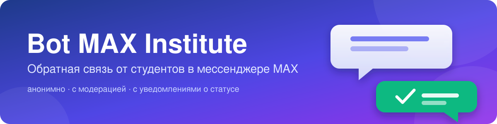
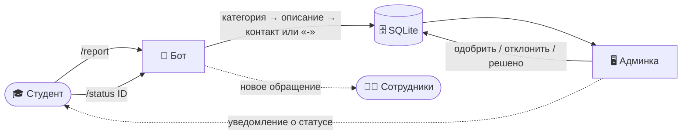
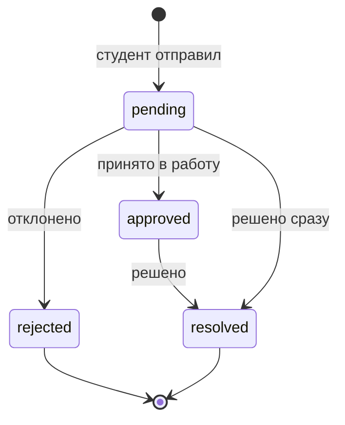

<div align="center">



<br>


**Бот принимает жалобы, вопросы и сообщения о конфликтах от студентов,<br>а сотрудники разбирают их в удобной веб-админке.**

[Возможности](#-возможности) · [Как это работает](#-как-это-работает) · [Быстрый старт](#-быстрый-старт) · [Токен бота](#-как-получить-токен-бота) · [Деплой](#-деплой) · [Структура](#-структура-проекта)

</div>

---

## ✨ Возможности

| | |
|---|---|
| 📝 **Диалог `/report`** | Категория → описание → контакт. Пять категорий, кнопки прямо в чате |
| 🕶️ **Настоящая анонимность** | Если вместо контакта отправить `-`, аккаунт MAX автора **не сохраняется вообще** — даже админ его не увидит |
| 🔎 **Статус по ID** | `/status A3F9B21C` показывает, на каком этапе обращение. Работает и для анонимных |
| 🔔 **Уведомления** | Автор получает сообщение при смене статуса, сотрудники — при новом обращении |
| 🛡️ **Модерация** | Веб-панель: счётчики по статусам, фильтры, «Одобрить / Отклонить / Решено» |
| 🧱 **Защита** | Лимит обращений в час, ограничение длины текста, защита админки от слабых паролей и CSRF |
| 🔐 **Приватность** | Команда `/privacy` объясняет студентам, что и как хранится |

## 🧭 Как это работает



<details>
<summary><b>Жизненный цикл обращения</b></summary>



Статус можно сменить из админки в любой момент; ID обращения — 8 символов hex, например `A3F9B21C`.

</details>

### 💬 Команды бота

| Команда | Что делает |
|---|---|
| `/start`, `/help` | Приветствие и список команд |
| `/report` | Оставить обращение |
| `/status ID` | Узнать статус обращения |
| `/cancel` | Отменить ввод на любом шаге |
| `/privacy` | Как используются данные |

## 🚀 Быстрый старт

> Нужен **Python 3.10+** — этого требует клиентская библиотека [`maxapi`](https://github.com/love-apples/maxapi).

```bash
git clone git@github.com:zxrubx/VIFSIN-MAX.git
cd VIFSIN-MAX

python3 -m venv venv
source venv/bin/activate
pip install -r requirements.txt

cp .env.example .env      # впишите BOT_TOKEN и ADMIN_PASSWORD
```

Запуск — два отдельных процесса:

```bash
python -m bot.main                                       # 🤖 бот (polling)
uvicorn admin.app:app --host 127.0.0.1 --port 8000       # 🖥️ админка
```

Админка: <http://127.0.0.1:8000> · логин `admin` · пароль из `ADMIN_PASSWORD`.
Со слабым паролем (`admin`, `change_me`, пустой) она сознательно **не запустится**.

### ⚙️ Настройки `.env`

| Переменная | Обязательна | Описание |
|---|:---:|---|
| `BOT_TOKEN` | ✅ | Токен бота из MAX |
| `ADMIN_PASSWORD` | ✅ | Пароль админки (простые значения отклоняются) |
| `DB_PATH` | | Путь к SQLite, по умолчанию `data/reports.db` |
| `ADMIN_HOST`, `ADMIN_PORT` | | Адрес админки, по умолчанию `127.0.0.1:8000` |
| `NOTIFY_USER_IDS` | | MAX `user_id` сотрудников через запятую — им придёт «Новое обращение» |
| `SUPPORT_CONTACT` | | Контакт администрации, показывается в `/privacy` |
| `RATE_LIMIT_PER_HOUR` | | Лимит обращений от одного пользователя в час, по умолчанию `5` |

## 🔑 Как получить токен бота

Бота в MAX может создать только зарегистрированный в РФ **самозанятый, ИП или юрлицо** — обычное физлицо не может.
Самозанятому это бесплатно: до 2 ботов на профиль.

1. Создайте и верифицируйте профиль на платформе для партнёров — [business.max.ru](https://business.max.ru) (самозанятые подтверждаются через Госуслуги).
2. Создайте карточку бота, укажите контакт поддержки и политику обработки данных (основа — текст `/privacy`).
3. Дождитесь модерации (до 48 рабочих часов) и получите токен → положите в `.env` как `BOT_TOKEN`.

📖 [Официальная инструкция MAX](https://dev.max.ru/docs/chatbots/bots-create/create)

## 🐳 Деплой

```bash
docker compose up -d --build
```

Поднимутся два контейнера — `bot` и `admin`, база лежит в `./data`. Админка слушает только `127.0.0.1:8000`: чтобы открыть её снаружи, поставьте перед ней reverse proxy с **HTTPS** (Basic Auth по голому HTTP небезопасен).

## 🧪 Тесты

```bash
pip install pytest httpx
pytest
```

Покрыты слой БД, админка (авторизация, XSS, CSRF, уведомления) и весь диалог бота — через подставной диспетчер, без обращения к сети MAX.

## 🗂️ Структура проекта

```text
bot/
├── main.py            # точка входа, polling
├── config.py          # настройки из .env
├── db.py              # SQLite: создание, чтение, смена статуса
├── notify.py          # личные сообщения (уведомления)
└── handlers/
    ├── start.py       # /start, /help, /privacy
    ├── feedback.py    # /report, /status, /cancel
    └── fallback.py    # ответ на непонятные сообщения
admin/
└── app.py             # FastAPI: список, фильтры, смена статуса
tests/                 # pytest
docs/                  # баннер
```

## ⚠️ Ограничения

- Состояние диалога и лимиты хранятся в **RAM**: после перезапуска бота незавершённый диалог придётся начать заново (для продакшена можно подключить Redis).
- Админка — один пользователь (`admin`) с HTTP Basic Auth. Для нескольких модераторов нужны полноценные сессии.
- В обращениях могут быть персональные данные. Если бот станет официальным, оформите согласие и политику по 152-ФЗ и ограничьте доступ к `data/`.

---

<div align="center">
<sub>Сделано для студентов института · общается через <a href="https://dev.max.ru">MAX Bot API</a></sub>
</div>
